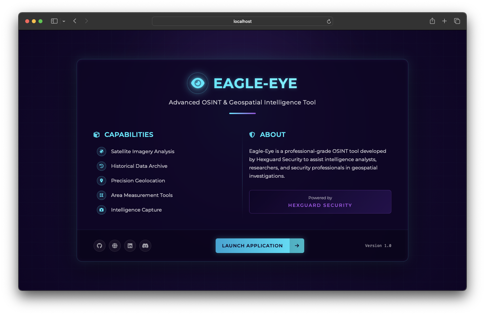
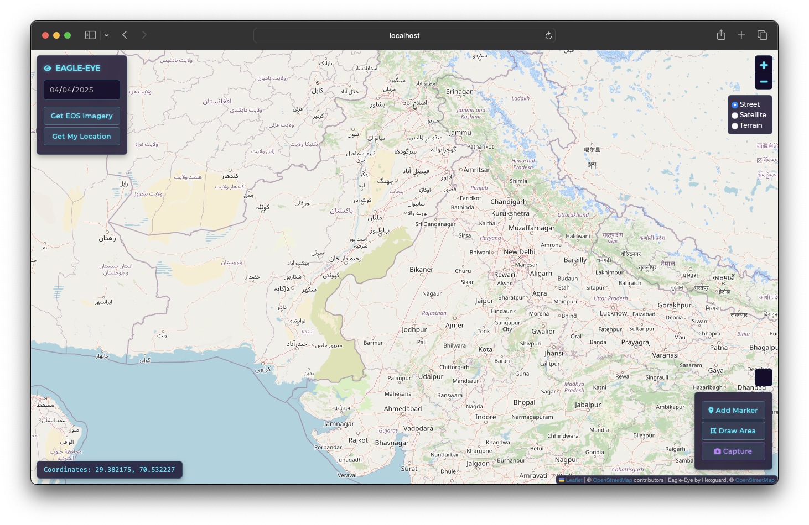
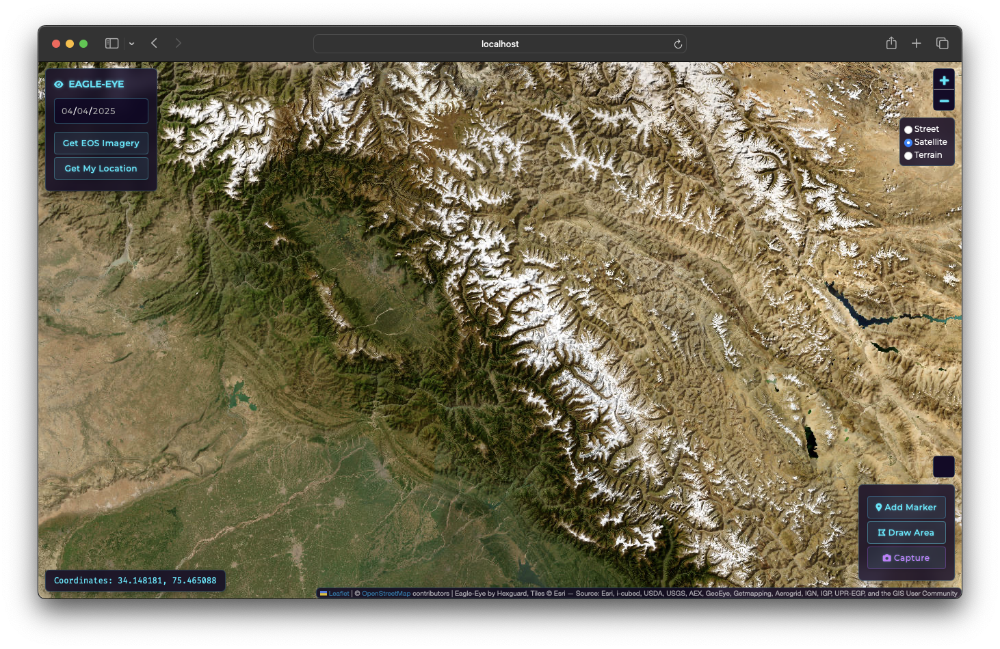

# 🦅 Eagle-Eye OSINT Tool

<div align="center">
  
  
  
  <br>
  <b>An advanced geospatial intelligence and satellite imagery analysis platform</b>
  <br>
  <b>Developed by <a href="https://hexguard.net" target="_blank">Hexguard Security</a></b>
</div>

<p align="center">
  
  <br>
  <em>Eagle-Eye professional splash screen</em>
</p>

## ⚠️ Educational Use Disclaimer

**IMPORTANT: Eagle-Eye is developed for EDUCATIONAL and RESEARCH purposes ONLY.**

This tool is intended for:
- Cybersecurity training and education
- Open-source intelligence research
- Academic study of geospatial data analysis

**Eagle-Eye should NEVER be used for:**
- Unauthorized surveillance
- Privacy infringement
- Any illegal activities or actions that violate local, national, or international laws
- Activities that could cause harm or damage to individuals, organizations, or infrastructure

Users must comply with all applicable laws and regulations when using satellite imagery and geospatial data, including but not limited to privacy laws, data protection regulations, and terms of service for any third-party data sources.

By using Eagle-Eye, you acknowledge and agree that you are solely responsible for ensuring your usage complies with all legal requirements in your jurisdiction.

## 🌟 Features

Eagle-Eye provides a comprehensive suite of OSINT capabilities for geospatial intelligence:

- **Satellite Imagery Access**: Interface with EOS LandViewer for high-resolution satellite imagery
- **Historical Data Analysis**: View and compare satellite imagery across different time periods
- **Precise Geolocation**: Coordinate-based intelligence gathering with interactive map controls
- **Measurement Tools**: Calculate distances and areas for spatial analysis
- **Intelligence Capture**: Screenshot and export capabilities for reporting and documentation
- **Advanced UI**: Professional, glass-morphic interface with intuitive controls

## 🖼️ Screenshots

<div align="center">
  <p><b>Street View Mode</b></p>
  
  <br><br>
  <p><b>Satellite View Mode</b></p>
  
</div>

## 🔧 Technical Requirements

- **Rust** 1.75 or higher
- **Modern Web Browser** (Chrome, Firefox, Safari, Edge)
- **Internet Connection** (required for satellite imagery retrieval)

## 📦 Installation

```bash
# Clone the repository
git clone https://github.com/hexguard/eagle-eye.git
cd eagle-eye

# Build the project
cargo build --release

# Run the application
cargo run --release
```

## 🚀 Usage Guide

### Starting the Application

After running the application, open your browser and navigate to:
```
http://localhost:8080
```

### Using the Interface

1. **Splash Screen**: Click the "LAUNCH APPLICATION" button to access the main interface
2. **Navigation**: Use the map controls to zoom in/out and navigate to areas of interest
3. **Imagery Retrieval**:
   - Navigate to your area of interest
   - (Optional) Select a date for historical imagery
   - Click "Get EOS Imagery" to retrieve satellite data
4. **Measurement & Analysis**:
   - Use the measurement tool to calculate distances and areas
   - Add markers to identify points of interest
   - Draw polygons to highlight regions for analysis
5. **Capturing Intelligence**:
   - Use the screenshot function to capture the current view
   - Images are saved locally in PNG format

### URL Parameters

Eagle-Eye supports direct access to locations via URL parameters:

```
http://localhost:8080/?lat=12.99979&lng=77.66641&z=14
```

Parameters:
- `lat`: Latitude (decimal degrees)
- `lng`: Longitude (decimal degrees)
- `z`: Zoom level (optional, default: 12)
- `date`: Date for historical imagery in YYYY-MM-DD format (optional)

## 🔒 Security Considerations

- **API Keys**: Eagle-Eye does not currently require API keys, but some satellite providers may in future versions
- **Data Storage**: All data is processed locally; no server-side storage of coordinates or imagery occurs
- **Network Security**: Ensure your network connection is secure when retrieving sensitive imagery
- **Operational Security**: Be aware that some satellite providers may log access patterns and requests

## 🛠️ Technical Architecture

Eagle-Eye is built using a hybrid architecture:

- **Backend**: Rust with Actix Web framework for high-performance, secure operations
- **Frontend**: Modern JavaScript with Leaflet.js for interactive mapping capabilities
- **Data Processing**: Client-side processing for imagery analysis and measurement calculations

## 🤝 Contributing

Contributions to Eagle-Eye are welcome from the OSINT and cybersecurity communities. Please review our [Contributing Guidelines](https://github.com/hexguard/eagle-eye/blob/main/CONTRIBUTING.md) before submitting pull requests.

When contributing, please ensure all code adheres to our coding standards and includes appropriate documentation.

## 📄 License

Eagle-Eye is released under the MIT License. See the [LICENSE](https://github.com/hexguard/eagle-eye/blob/main/LICENSE) file for details.

## 🔗 Links

- [Hexguard Security](https://hexguard.net)
- [GitHub Repository](https://github.com/hexguard/eagle-eye)
- [Issue Tracker](https://github.com/hexguard/eagle-eye/issues)
- [Contributing Guidelines](https://github.com/hexguard/eagle-eye/blob/main/CONTRIBUTING.md)

## 📞 Contact

For inquiries regarding Eagle-Eye or other Hexguard Security tools, please contact:

- Email: [info@hexguard.net](mailto:info@hexguard.net)
- Discord: [Hexguard Community](https://discord.gg/j2fFUYT8h7)
- LinkedIn: [Hexguard Security](https://www.linkedin.com/company/hexguardsec)

---

<div align="center">
  <p>&copy; 2025 Hexguard Security. All rights reserved.</p>
  <p>&#x1F510; Empowering intelligence operations through ethical OSINT tools &#x1F510;</p>
</div>
